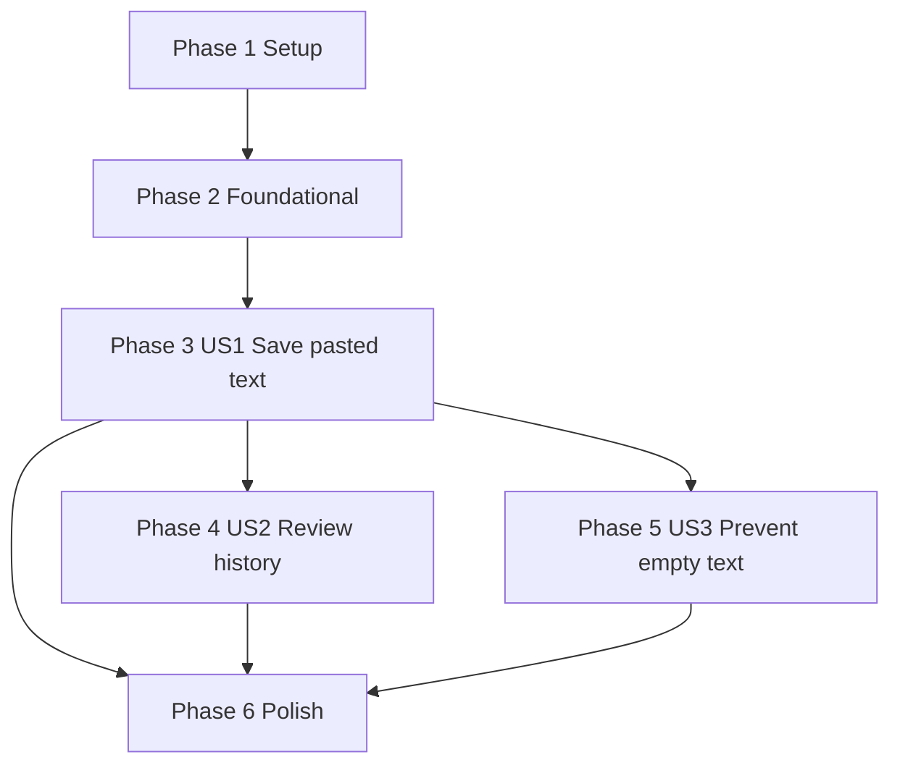

# Tasks: Create Text Clip

**Input**: Design documents from `specs/001-create-text-clip/`

**Prerequisites**: [plan.md](plan.md), [spec.md](spec.md), [research.md](research.md), [data-model.md](data-model.md), [contracts/](contracts/), [quickstart.md](quickstart.md)

**Tests**: Required by FR-014 and the NextPaste constitution. Write the tests in each user story before the implementation tasks for that story and verify they fail for the expected missing behavior before making them pass.

**Organization**: Tasks are grouped by user story so each story can be implemented and validated independently after the shared foundation is complete.

## Format: `[ID] [P?] [Story] Description`

- **[P]**: Can run in parallel because it edits different files and does not depend on an incomplete task.
- **[Story]**: Required only for user story tasks, using `[US1]`, `[US2]`, and `[US3]`.
- Every task description includes exact file paths.

---

## Phase 1: Setup (Shared Infrastructure)

**Purpose**: Establish a deterministic starting point and UI test launch path before feature implementation.

- [ ] T001 Run `xcodebuild -project NextPaste.xcodeproj -scheme NextPaste -destination 'platform=macOS' build` from the repository root and record any feature-relevant baseline failures in `specs/001-create-text-clip/quickstart.md`
- [ ] T002 [P] Create UI test launch helper with `-ui-testing` arguments in `NextPasteUITests/UITestAppLauncher.swift`

---

## Phase 2: Foundational (Blocking Prerequisites)

**Purpose**: Add shared app-container and test-container support needed by all user stories.

**CRITICAL**: No user story implementation should begin until this phase is complete.

- [ ] T003 Update app model-container creation to support an in-memory store for `-ui-testing` launches in `NextPaste/NextPasteApp.swift`
- [ ] T004 [P] Create reusable in-memory SwiftData test container support for `ClipItem` tests in `NextPasteTests/SwiftDataTestSupport.swift`

**Checkpoint**: Test harness and app launch support are ready for story-specific tests.

---

## Phase 3: User Story 1 - Save Pasted Text As A Clip (Priority: P1) MVP

**Goal**: Users can open `NewClipView`, enter or paste non-empty plain text, save it locally as a `ClipItem`, and return to history with the new clip visible.

**Independent Test**: Open the new clip screen, enter sample text, save, and verify a saved text clip exists with original content, `contentType == "text"`, and matching `createdAt`/`updatedAt` metadata.

### Tests For User Story 1

- [ ] T005 [P] [US1] Add failing `ClipItem` creation tests for id, `contentType`, text preservation, and timestamp parity in `NextPasteTests/ClipItemTests.swift`
- [ ] T006 [P] [US1] Add failing create text clip UI tests for opening `NewClipView`, entering text, saving, dismissing, seeing history text, and preserving the draft with exact `save-error-message` text "Clip was not saved. Try again." when save fails in `NextPasteUITests/CreateTextClipUITests.swift`

### Implementation For User Story 1

- [ ] T007 [US1] Create SwiftData `ClipItem` model with `id`, `contentType`, `textContent`, `createdAt`, and `updatedAt` in `NextPaste/ClipItem.swift`
- [ ] T008 [US1] Replace the starter SwiftData schema entry with `ClipItem.self` and keep test-mode storage support working in `NextPaste/NextPasteApp.swift`
- [ ] T009 [US1] Create `NewClipView` with text editor, save/cancel controls, and `clip-text-editor`, `save-clip-button`, `cancel-new-clip-button`, `save-error-message` accessibility identifiers in `NextPaste/NewClipView.swift`
- [ ] T010 [US1] Create `HomeView` shell with `new-clip-button`, `clip-history-list`, sheet or navigation presentation of `NewClipView`, and basic clip visibility in `NextPaste/HomeView.swift`
- [ ] T011 [US1] Update the root view to host `HomeView` while preserving platform navigation behavior in `NextPaste/ContentView.swift`
- [ ] T012 [US1] Implement successful local SwiftData insert, automatic dismiss after save, and save-failure handling that retains draft text, prevents partial history insertion, and shows exactly "Clip was not saved. Try again." via `save-error-message` in `NextPaste/NewClipView.swift`
- [ ] T013 [US1] Run `xcodebuild -project NextPaste.xcodeproj -scheme NextPaste -destination 'platform=macOS' -only-testing:NextPasteTests/ClipItemTests test` for `NextPasteTests/ClipItemTests.swift` and `xcodebuild -project NextPaste.xcodeproj -scheme NextPaste -destination 'platform=macOS' -only-testing:NextPasteUITests/CreateTextClipUITests test` for `NextPasteUITests/CreateTextClipUITests.swift`; if either command fails, stop and fix the failing tests before continuing

**Checkpoint**: MVP is functional and testable: non-empty text can be saved locally and seen in history after dismissal.

---

## Phase 4: User Story 2 - Review Saved Text In History (Priority: P2)

**Goal**: Saved text clips appear in `HomeView` history with recognizable preview text, newest first, without network access.

**Independent Test**: Save or seed multiple clips with different `createdAt` values and verify `HomeView` shows the newest clip first with enough text to recognize it.

### Tests For User Story 2

- [ ] T014 [P] [US2] Add failing newest-first history ordering and FR-008a preview-formatting tests using local SwiftData clips in `NextPasteTests/ClipHistoryTests.swift`, covering newline replacement with spaces, 120-character preview truncation with an ellipsis, and unchanged stored `textContent`
- [ ] T015 [P] [US2] Add failing history UI test that creates two clips, asserts the newer text appears before the older text, verifies a long multiline clip is shown with the FR-008a preview format, and validates local-store history review without CloudKit or network-dependent code paths in `NextPasteUITests/HistoryListUITests.swift`

### Implementation For User Story 2

- [ ] T016 [US2] Add reusable descending `createdAt` history sort descriptors or equivalent ordering support in `NextPaste/ClipItem.swift`
- [ ] T017 [P] [US2] Create readable text clip row preview in `NextPaste/ClipRowView.swift` that replaces newlines with spaces, limits visible preview text to 120 characters plus an ellipsis when truncated, and never mutates stored `textContent`
- [ ] T018 [US2] Implement SwiftData `@Query` history sorted by `createdAt` descending and an empty state in `NextPaste/HomeView.swift`
- [ ] T019 [US2] Integrate `ClipRowView` into the `clip-history-list` display in `NextPaste/HomeView.swift`
- [ ] T020 [US2] Run `xcodebuild -project NextPaste.xcodeproj -scheme NextPaste -destination 'platform=macOS' -only-testing:NextPasteTests/ClipHistoryTests test` for `NextPasteTests/ClipHistoryTests.swift` and `xcodebuild -project NextPaste.xcodeproj -scheme NextPaste -destination 'platform=macOS' -only-testing:NextPasteUITests/HistoryListUITests test` for `NextPasteUITests/HistoryListUITests.swift`; if either command fails, stop and fix the failing tests before continuing

**Checkpoint**: History review is independently testable with local data and newest-first ordering.

---

## Phase 5: User Story 3 - Prevent Empty Text Clips (Priority: P3)

**Goal**: Empty and whitespace-only submissions are blocked with a clear validation message and no inserted clip.

**Independent Test**: Open `NewClipView`, leave text empty or whitespace-only, tap save, and verify validation is shown while history remains unchanged.

### Tests For User Story 3

- [ ] T021 [P] [US3] Add failing validation tests for empty text, whitespace-only text, valid text, original-text preservation, and exact validation message "Enter text to save a clip." in `NextPasteTests/ClipValidationTests.swift`
- [ ] T022 [P] [US3] Add failing empty-save and cancel/dismiss UI tests for `text-validation-message`, staying on `NewClipView` after invalid save, and no new history row after invalid save or cancel in `NextPasteUITests/EmptyTextClipUITests.swift`

### Implementation For User Story 3

- [ ] T023 [US3] Implement local whitespace/newline validation helper and exact validation message "Enter text to save a clip." in `NextPaste/ClipValidation.swift`
- [ ] T024 [US3] Integrate validation failure state, `text-validation-message` accessibility identifier, and cancel/dismiss no-insert behavior into `NextPaste/NewClipView.swift`
- [ ] T025 [US3] Run `xcodebuild -project NextPaste.xcodeproj -scheme NextPaste -destination 'platform=macOS' -only-testing:NextPasteTests/ClipValidationTests test` for `NextPasteTests/ClipValidationTests.swift` and `xcodebuild -project NextPaste.xcodeproj -scheme NextPaste -destination 'platform=macOS' -only-testing:NextPasteUITests/EmptyTextClipUITests test` for `NextPasteUITests/EmptyTextClipUITests.swift`; if either command fails, stop and fix the failing tests before continuing

**Checkpoint**: Empty text is blocked locally, the draft remains editable, and no invalid `ClipItem` is inserted.

---

## Phase 6: Polish & Cross-Cutting Concerns

**Purpose**: Confirm privacy, local-first behavior, native framework boundaries, and final validation across all stories.

- [ ] T026 [P] Remove the obsolete starter timestamp-only model after all references use `ClipItem` in `NextPaste/Item.swift`
- [ ] T027 [P] Review-only: verify `ClipItem` has CloudKit-compatible SwiftData defaults and no unsupported uniqueness constraints in `NextPaste/ClipItem.swift` without enabling CloudKit sync or adding CloudKit runtime code
- [ ] T028 [P] Review the save path for no Vision OCR, Foundation Models output generation, Firebase, third-party analytics, or remote user-content transmission in `NextPaste/NewClipView.swift`
- [ ] T029 [P] Update final test class names or commands if implementation names differ in `specs/001-create-text-clip/quickstart.md`
- [ ] T030 Run `xcodebuild -project NextPaste.xcodeproj -scheme NextPaste -destination 'platform=macOS' -only-testing:NextPasteUITests/HistoryListUITests test` for offline/local-first validation of FR-011 and SC-006 using the `-ui-testing` local-store mode; if this command fails, stop and fix the failing offline behavior before continuing
- [ ] T031 Run `xcodebuild -project NextPaste.xcodeproj -scheme NextPaste -destination 'platform=macOS' test` from the repository root; if this command fails, record release-blocking failures in `specs/001-create-text-clip/quickstart.md`, stop, and fix the failing tests before continuing

---

## Dependencies & Execution Order

### Phase Dependencies



- **Setup (Phase 1)**: No dependencies.
- **Foundational (Phase 2)**: Depends on Setup and blocks all user stories.
- **User Story 1 (Phase 3)**: Depends on Foundational; recommended MVP scope.
- **User Story 2 (Phase 4)**: Depends on the US1 `ClipItem` model in `NextPaste/ClipItem.swift` and `HomeView` surface in `NextPaste/HomeView.swift`.
- **User Story 3 (Phase 5)**: Depends on the US1 `NewClipView` save path in `NextPaste/NewClipView.swift`.
- **Polish (Phase 6)**: Depends on all selected user stories being complete.

### User Story Dependencies

- **US1 (P1)**: No dependency on other user stories after the foundation; delivers the model, `HomeView`, and `NewClipView` save path used by later stories.
- **US2 (P2)**: Depends on US1 tasks T007 and T010 because history review extends the `ClipItem` model and `HomeView` history surface.
- **US3 (P3)**: Depends on US1 tasks T009 and T012 because empty-text validation integrates with the `NewClipView` save path.

### User Story Completion Order

1. **US1 Save pasted text as a clip**: MVP and first delivery target.
2. **US2 Review saved text in history**: Adds robust history presentation and newest-first ordering.
3. **US3 Prevent empty text clips**: Adds validation hardening and invalid-save UI behavior.

### Within Each User Story

- Write story tests first and verify they fail for the expected missing behavior.
- Implement models and shared ordering helpers before views that query them.
- Implement SwiftUI views before UI test stabilization.
- Run the story-specific validation task before starting the next story.

---

## Parallel Opportunities

- T002 and T004 can proceed independently after baseline setup.
- T005 and T006 can be written in parallel because they touch different test targets.
- T014 and T015 can be written in parallel because they use separate test files.
- T017 can be implemented alongside T018 once the history ordering contract is clear.
- T021 and T022 can be written in parallel because they touch different test targets.
- T026 through T030 can be reviewed or validated before T031 runs the full suite.

## Parallel Example: User Story 1

```text
Task T005: Add failing ClipItem creation tests in NextPasteTests/ClipItemTests.swift
Task T006: Add failing create text clip UI test in NextPasteUITests/CreateTextClipUITests.swift

After T007 and T008 complete, complete T009 and T010 sequentially before integrating the root flow.
```

## Parallel Example: User Story 2

```text
Task T014: Add history ordering unit test in NextPasteTests/ClipHistoryTests.swift
Task T015: Add history UI test in NextPasteUITests/HistoryListUITests.swift

After T016 completes:
Task T017: Create ClipRowView in NextPaste/ClipRowView.swift
Task T018: Implement sorted history query in NextPaste/HomeView.swift
```

## Parallel Example: User Story 3

```text
Task T021: Add validation unit tests in NextPasteTests/ClipValidationTests.swift
Task T022: Add empty-save UI test in NextPasteUITests/EmptyTextClipUITests.swift
```

---

## Implementation Strategy

### MVP First

1. Complete Phase 1 and Phase 2.
2. Complete Phase 3 only.
3. Validate with the User Story 1 tests and a manual save-flow check.
4. Stop if the goal is a minimal demo of local text clip creation.

### Incremental Delivery

1. Deliver US1 so users can save a local text clip.
2. Deliver US2 so history ordering and preview behavior are reliable.
3. Deliver US3 so invalid empty clips cannot enter local storage.
4. Run Phase 6 validation before considering the feature complete.

### Parallel Team Strategy

1. Complete Phase 1 and Phase 2 together.
2. Split work by story after the foundation is complete: one owner for US1, one for US2, and one for US3.
3. Coordinate changes to `NextPaste/HomeView.swift`, `NextPaste/NewClipView.swift`, and `NextPasteUITests/CreateTextClipUITests.swift` because those files receive sequential story-specific edits.

### Validation Scope

- Unit coverage: `ClipItem` creation, timestamp parity, validation, and history ordering.
- UI coverage: create text clip flow, automatic dismissal, visible history text, newest-first ordering, and empty-save validation.
- Privacy/local-first coverage: no external transmission, no third-party analytics, no Firebase, no Vision OCR execution, no Foundation Models output generation, and offline-capable local save/review.

## Notes

- Keep SwiftData local storage as the source of truth for this feature.
- Keep CloudKit as review-only for this feature; do not enable CloudKit sync or add CloudKit runtime code. Do not enable Vision OCR, Foundation Models output, Firebase, analytics SDKs, or cross-platform frameworks as part of these tasks.
- Preserve original submitted text in `ClipItem.textContent`; use trimming only to decide whether a submission is empty.
- Maintain stable accessibility identifiers from [contracts/create-text-clip-flow.md](contracts/create-text-clip-flow.md) for UI automation.